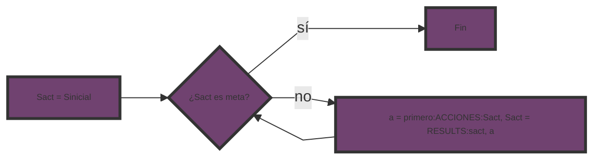
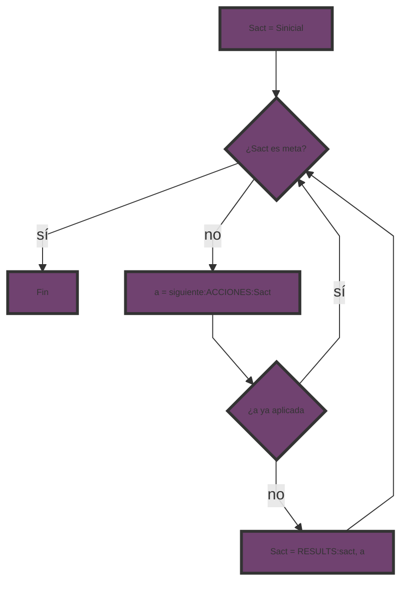
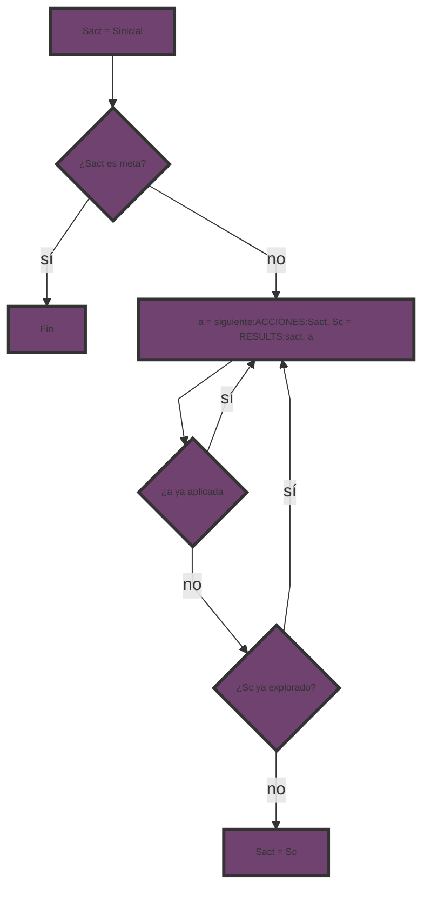
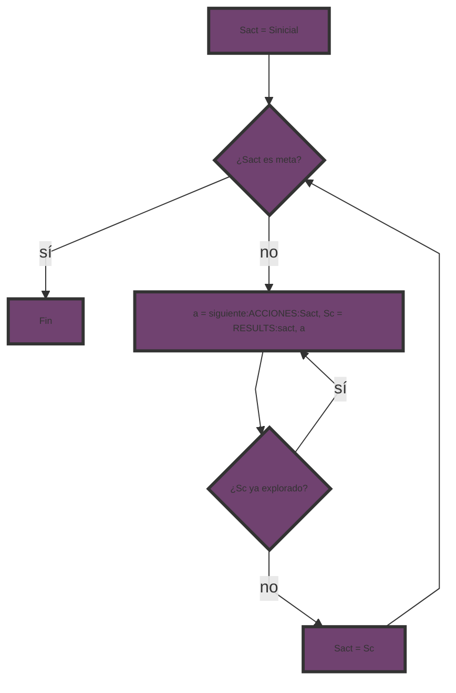

***[[Sistemas Inteligentes]]***

**ETAPAS**
****
1. **Formulación de metas**: el agente o el diseño del problema deciden las metas.
2. **Formulación del problema**: representación abstracta del problema basada en estados y acciones aplicables.
3. **Búsqueda**: encontrar, a partir de la formulación del problema, una solución a través de un proceso genérico independiente.
4. **Ejecución**: aplicación de las acciones que componen la solución.

**PROBLEMAS DE BÚSQUEDA**
****
> Disponemos de dos cubos inicialmente vacíos, uno de 8 litros (A) y el otro de 6 litros (B). Ninguno de los cubos tiene marcas ni divisiones. Disponemos de un grifo que se puede emplear para llenar los cubos. ¿Qué tenemos que hacer para llenar el cubo de 8 litros justamente hasta la mitad?

Un problema está compuesto por:
1. Estado inicial.
2. Conjunto de acciones.
3. Modelo de transición.
4. Prueba de meta.
5. Función de coste del camino.

- **Estado inicial del agente**:
	Representaremos cada situación del problema con un estado. Podemos representar estados con (x, y), siendo _x_ la cantidad que hay en A e _y_ la que hay en B. Los cubos empiezan vacíos en (0, 0).
- **Descripción de las acciones disponibles**:
	Para un estado dado _s_, `ACCIONES(s)` devuelve el conjunto de acciones legales en _s_.
	`ACCIONES((0, 0)) = {Llenar_A, Llenar_B}`
	Las acciones se pueden listar exhaustivamente, indicando `ACCIONES(s)` para cualquier estado _s_.
	
|  **ACCIÓN**   |           **PRECONDICIONES**           |
| :-----------: | :------------------------------------: |
|   llenar A    |               A no lleno               |
|   llenar B    |               B no lleno               |
|   vaciar A    |               A no vacío               |
|   vaciar B    |               B no vacío               |
| vaciar A en B | A no vacío, B no lleno, [A] + [B] <= 6 |
| vaciar B en A | B no vacío, A no lleno, [A] + [B] <= 8 |
| llenar A en B | B no vacío, A no lleno, [A] + [B] > 8  |
| llenar B en A | A no vacío, B no lleno, [A] + [B] > 6  |
- **Modelo de transiciones**:
	Describe lo que hace cada acción. `RESULT(s, a)` devuelve el estado que resulta de realizar la acción _a_ en el estado _s_. Denominamos sucesor a cualquier estado alcanzable desde un estado dado mediante una única acción.
	`RESULT((0, 0), Llenar_A) = (8, 0)`
	
|  **ACCIÓN**   |          **PRECONDICIONES**           | **RESULTADO**  |
| :-----------: | :-----------------------------------: | :------------: |
|   llenar A    |           (x, y) con x != 8           |     (8, y)     |
|   llenar B    |           (x, y) con y != 6           |     (x, 6)     |
|   vaciar A    |           (x, y) con x != 0           |     (0, y)     |
|   vaciar B    |           (x, y) con y != 0           |     (x, 0)     |
| vaciar A en B | (x, y) con x != 0, y != 6, x + y <= 6 |   (0, x + y)   |
| vaciar B en A | (x, y) con x != 8, y != 0, x + y <= 8 |   (x + y, 0)   |
| llenar A en B | (x, y) con x != 8, y != 0, x + y > 8  | (8, x + y - 8) |
| llenar B en A | (x, y) con x != 0, y != 6, x + y > 6  | (x + y - 6, 6) |
	El espacio de estados es el conjunto de todos los estados alcanzables desde el estado inicial a través de cualquier secuencia de acciones.
	Forma un **grafo dirigido** en el que los **nodos** son estados y los **arcos** entre nodos las acciones.
	Un **camino** es una secuencia de estados conectados por acciones.

- **Test objetivo o prueba de meta**:
	Determina si un estado es el estado meta, si pertenece a un conjunto explícito de estados meta o si cumple con una propiedad abstracta.

- **Función coste del camino**:
	Asigna un coste numérico a cada camino y refleja la **medida de rendimiento**.
	El coste de un camino se asume como la suma de los costes de las acciones del camino.
	El coste individual de una acción _a_, desde _s_ a _s'_ se denota C(s, a, s'), asumiremos que los costes no son negativos.

**PROCESO DE BÚSQUEDA**
****
Una vez tenemos el espacio de estados definido, obtener la solución consiste en encontrar un camino que conduzca de un estado inicial a un estado final. Debemos definir un **procedimiento de exploración sistemático**.

**BÁSICA 1**

- **Dos cubos**: 
	(0, 0) Llenar_A (8, 0) Llenar_B (8, 6) Vaciar_A (0, 6) Llenar_A (8, 6) -> bucle

**BÁSICA 2**

- **Dos cubos**:
	(0, 0) Llenar_A (8, 0) Llenar_B (8, 6) Vaciar_A (0, 6) Vaciar_B (0, 0)
	Se termina sin hallar la solución, desde (0, 0) no hay más acciones disponibles (solo son aplicables Llenar_A y Llenar_B, pero ya se utilizaron).
	Requiere estructuras adicionales (autoconocimiento) y un registro de acciones ya aplicadas.

**BÁSICA 3**

- **Dos cubos**:
	(0, 0) Llenar_A (8, 0) Llenar_B (8, 6) Vaciar_A (0, 6) Vaciar_B_en_A (6, 0)
	Se termina sin hallar solución, desde (6, 0) no hay más acciones disponibles (las que son aplicables ya se han utilizado o llevan a un estado conocido).
	Requiere más estructuras adicionales y un registro de estados ya visitados.

**BÁSICA 4**

- **Dos cubos**:
	(0, 0) Llenar_A (8, 0) Llenar_B (8, 6) Vaciar_A (0, 6) Vaciar_B_en_A (6, 0) Llenar_B (6, 6) Llenar_A_con_B (8, 4) Vaciar_A (0, 4) Vaciar_A_en_B (4, 0)
	Se halla una solución, aunque no hay garantías de que esta estrategia la encuentre para cualquier problema. La solución no es la más óptima.

**ESTRATEGIAS DE BÚSQUEDA**
****
- **Técnicas de búsqueda de propósito específico**: diseñadas "ad hoc" para resolver un problema concreto.
- **Técnicas de búsqueda de propósito general**: aproximaciones sistemáticas que se pueden aplicar a cualquier problema.

1. _Dirección de la búsqueda_
	El proceso de búsqueda puede ser:
	- _Progresivo_: partiendo de los estados iniciales hacia los estados meta.
	- _Regresivo_: partiendo de los estados meta hacia los estados iniciales.
	Para escoger qué proceso emplear, hay que fijarse en:
	1. **Número de estados iniciales vs. número de metas**: recorrer de menor a mayor número de estados.
	2. **Factor de ramificación**: número promedio de estados que podemos alcanzar directamente desde un estado dado. Dirigirse hacia estados con menor factor de ramificación.
	3. Inclusión de **estructuras explicativas** como requisito inicial en el diseño de nuestro sistema inteligente, de forma parecida a un humano.
2. _Topología del proceso_
	Los algoritmos de búsqueda construyen secuencias de acciones a partir de un estado inicial. Estas secuencias forman un árbol de búsqueda:
	- **Raíz**: estado inicial.
	- **Ramas**: acciones a realizar.
	- **Nodos**: estados del espacio de estados.
	- **Hojas**: estados que no tienen sucesor o que aún no se le conoce.
	```
	función BUSQUEDA_ARBOL(problema) produce solución o fallo
		inicializar la frontera usando el estado inicial del problema
		bucle hacer
			si la frontera está vacía entonces devolver fallo
			sino escoger un nodo hoja y eliminarlo de la frontera
			si nodo hoja contiene un estado meta, entonces devolver solución
			sino expandir nodo elegido y añadir nodos resultantes a frontera
		fin
	```
	Si el espacio de estados es un grafo, se producirán caminos redundantes. Para evitarlo, debemos llevar la cuenta de los nodos explorados.
	```
	función BÚSQUEDA_GRAFO(){
		frontera = estado inicial
		while(1){
			si frontera vacía return error
			sino elegir nodo hoja y eliminarlo de la frontera
			si nodo meta return nodo
			sino añadir nodo a explorados
				añadir nodos expandidos a frontera 
				si no están explorados o ya son frontera
		}
	}
	```
	La búsqueda en árbol es más eficiente, pero consume más memoria. La búsqueda en grafo es más lenta, pero consume menos memoria.

3. _Selección de acciones_
	Se denomina emparejamiento al proceso de selección de acciones a aplicar al estado actual. Si el proceso es dirigido por los datos, se comprueban las precondiciones. Si el proceso es dirigido por los objetivos, se comprueban los resultados. Normalmente se siguen estas reglas:
	- Intentar no aplicar acciones ya aplicadas.
	- Aplicar acciones que lleven a estados nuevos.
	- Aplicar primero operadores con precondiciones más restrictivas.
	- Si no se puede aplicar lo anterior, elegimos al azar.
4. _Uso de heurísticas_
	Las heurísticas son funciones numéricas que nos permiten estimar el beneficio de una transición del espacio de estados. Sirven para optimizar los procesos de búsqueda según el mejor camino a priori.

- **Creación de un nodo**:
	Un nodo es la representación de un estado en un árbol de búsqueda. Sirve para reconstruir la solución, por lo tanto debe tener anotados su padre y la acción que llevó hasta él.
	```
	función crear_nodo(e, p, a){
		n = nuevo nodo
		n.estado = e
		n.padre = p
		n.acción = a
		return n
	}
	```
- **Función sucesores:**
	Permite expandir un nodo. Devuelve la lista de nodos sucesores.
	```
	función sucesores(n){
		para cada acción aplicable a n.estado{
			n_aux = crear_nodo(resultado, n, acción)
			insertar n_aux en lista de sucesores
		}
		return sucesores
	}
	```
- **Estructuras de datos**:
	La estructura ideal para los nodos ya explorados es una tabla hash para permitir inserciones y búsquedas rápidas. Para la frontera, podemos usar una pila, cola o cola de prioridad.
- **Evaluación**:
	Las estrategias de búsqueda se evalúan según:
	1. Completitud.
	2. Complejidad temporal.
	3. Complejidad espacial.
	4. Optimización.
	Tanto la complejidad temporal como espacial se miden mediante el factor de ramificación, la profundidad de la solución menos costosa y la profundidad máxima.
	
	El coste total se mide como:
	$$coste\ total = coste\ búsqueda + coste\ camino$$

Las estrategias de búsqueda pueden ser:
- **No informadas o ciegas**: no saben nada de los estados que no sea lo que proporciona el propio problema.
- **Informadas o heurísticas**: disponen del conocimiento suficiente para alcanzar el objetivo de una forma más eficiente.

**ESTRATEGIAS NO INFORMADAS**
****
- **Búsqueda en amplitud**:
	Se usa una cola para la frontera. Se expande el nodo que entró hace más tiempo, es decir, el nodo menos profundo. El efecto que deja este algoritmo es que explora un nivel de profundidad al completo antes de pasar al siguiente. Siempre encuentra la solución que requiere menos pasos si tiene memoria y tiempo suficientes.
	![[Pasted image 20240420190814.png]]

- **Búsqueda de coste uniforme**:
	La cola de la frontera pasa a ser una cola de prioridad ordenada por coste. Se expande siempre el camino con menor coste. Siempre obtiene una solución óptima.
	![[Pasted image 20240420185804.png]]

- **Búsqueda en profundidad**:
	Se usa una pila para la frontera. Se expande el nodo que entró hace menos tiempo, es decir, se sigue cada camino hasta el final antes de cambiar. Es completa, pero no es óptima, ya que puede encontrar una solución más profunda que otra que esté en una rama no expandida.
	![[Pasted image 20240420191321.png]]

- **Búsqueda de profundidad limitada**:
	Consiste en poner un límite a la profundidad máxima que se puede explorar para evitar caer en caminos infinitos. Esta engloba las ventajas de la búsqueda en profundidad y búsqueda en anchura.

**ESTRATEGIAS INFORMADAS**
****
- **Búsqueda avara**:
	La frontera es una cola de prioridad por la heurística. Se expande el nodo con menor valor de heurística. No es óptima. Es completa solo si el espacio de estados es finito y existe control de repetidos. 
	![[Pasted image 20240420192021.png]]

- **Búsqueda A* (estrella)**
	Consiste en evaluar los nodos combinando g(n), que es el coste real hasta alcanzar el nodo n y h(n), que es el coste estimado del camino menos costoso hacia la meta.
	![[Pasted image 20240420192507.png]]
	Para que A* sea óptima:
	- Si hay algún estado no meta al que se puede llegar de más de una forma, necesitamos que la heurística sea admisible, es decir, que nunca sobreestime el coste de llegar a la meta.
	- Si hay estados no meta a los que se puede llegar de más de una forma, necesitamos que la heurística sea consistente, es decir, que h(n) debe ser menor que cualquiera otra ruta que implique nodos de por medio.
	A* es completa si todos los pasos tienen coste positivo y ramificación finita. La complejidad temporal es exponencial. El problema es la complejidad espacial, ya que puede ser demasiado costosa al mantener todos los nodos en memoria.
	
	Para calcular la heurística de un estado debemos obtener el coste que requiere solucionar el problema desde ese estado. Aunque esto sería ilógico, ya que buscamos la heurística para solucionar el problema. Podemos simplificar el problema eliminando restricciones y de ahí sacar buenas heurísticas.

- **Búsqueda local**:
	Usa un único estado, el estado actual, y solo se mueve a estados vecinos. No guarda los caminos porque lo único que valora es que llegue a la meta. Suelen gastar poca memoria y encontrar soluciones en espacio de estados grandes o infinitos. Por ejemplo, el algoritmo de escalada:
	```
	función hill_climbing(){
		nodo_actual = crear_nodo(nodo_inicial)
		while(true){
			vecino = nodo sucesor con mejor valor de función
			si valor(vecino) <= valor(nodo_actual)
				return nodo_actual.estado
			nodo_actual = vecino
		}
	}
	```
	Los inconvenientes de este algoritmo son:
	- **Máximos locales**: son estados puntuales mejores que sus vecinos pero peores que estados más alejados. Se solucionan con backtracking.
	- **Mesetas**: son regiones donde todos los estados tienen el mismo valor para la función heurística y no es posible determinar una dirección para avanzar. Se solucionan con un salto en el espacio de búsqueda para probar con otra región del espacio de estados.
	- **Crestas**: son regiones del espacio con mejores valores de función heurística, pero a los cuales no podemos llegar mediante transiciones simples. La solución es moverse en más de una dirección.