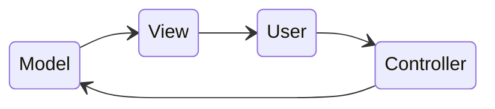

***[[Interfaces Persona Máquina]]***

**MODEL VIEW CONTROLLER (MVC)**
****
Separa los datos y la lógica de negocio de una app de su representación y el módulo encargado de gestionar los eventos y las comunicaciones. Se basa en la reutilización de código y la separación de conceptos.
- *Modelo*: define qué datos debe contener la app. Si el estado de los datos cambia, este notifica a la vista y, a veces, al controlador.
- *Vista*: define cómo deben verse los datos (los recibe del modelo) de la app.
- *Controlador*: contiene la lógica que actualiza el modelo y/o vista en respuesta a los inputs del usuario.


**CONCURRENCIA EN LAS INTERFACES DE USUARIO**
****
Permite la creación de interfaces que respondan mejor a las órdenes del usuario. Cuando una app tiene que realizar una larga tarea, su interfaz debería seguir respondiendo y no bloquearse. Por ejemplo, la ventana de la app debería refrescarse y no quedarse en blanco, o los botones para cancelar una operación deberían cancelar la operación de un modo inmediato.

**USABILIDAD**
****
Es lo bien o mal que los usuarios son capaces de usar la funcionalidad de un sistema.
Tiene varias dimensiones:
1. *Aprendizaje*: Define si es fácil de aprender a usar.
2. *Eficiencia*: Cómo de rápido es de usar.
3. *Recuerdo*: ¿Es fácil retener lo aprendido?
4. *Errores*: ¿Son escasos los errores y es recuperable el sistema?
5. *Satisfacción*: ¿Es disfrutable su uso?

**DIMENSIONES DEL DESARROLLO DEL SOFTWARE**
****
- *Funcionalidad*
- *Rendimiento*
- *Coste*
- *Seguridad*
- *Usabilidad*
- *Fiabilidad*

**MODELO EN CASCADA PARA IU**
****
Proceso arriesgado y menos predecible de lo normal, el usuario no interviene hasta la fase de aceptación.

**DESARROLLO EN ESPIRAL PARA IU**
****
Hay un mayor control del proceso. Los errores serían más baratos de detectar en una etapa inicial (prototipado). Iteraciones más avanzadas poseen más detalles. Cada prototipo es evaluado por el usuario.

**ETAPAS DEL PROCESO DE DISEÑO**
****
1. *Análisis de usuarios/tareas*.
2. *Diseño de la solución propuesta*.
3. *Implementación de la solución*.
4. *Testeo de la solución*.

**PRUEBAS DE LA SOLUCIÓN IMPLEMENTADA**
****
1. *Funcionalidad* → ¿Hace lo que tiene que hacer?
2. *Usabilidad* → extraer feedback de los usuarios.
3. *Pruebas de stress* → simulaciones de carga reales.
4. *Recuperación ante errores*
5. *Seguridad*
6. *Alpha testing* → pruebas en las etapas iniciales del desarrollo.
7. *Beta testing* → etapas más avanzadas del desarrollo, pero aún no en producción.

**NIVELES DE ACCESIBILIDAD**
****
- *A* → esencial
- *AA* → soporte ideal
- *AAA* → soporte especializado

**SECCIÓN 508**
****
Estándares de accesibilidad requeridos para software público en USA.

***¿Cómo hacer que una web sea más accesible?***
1. Navegable por teclado.
2. Agregar texto alternativo a imágenes.
3. Elección de los colores con cuidado → la información no puede depender del color.
4. Usar encabezados para estructurar tu contenido correctamente.
5. Formularios accesibles agrupando elementos relacionados.
6. No producir un cambio de contexto cuando el usuario selecciona o introduce información, sólo con botones o enlaces.
7. Proporcionar una descripción clara del objetivo de cada enlace/botón.
8. Cada web debe proporcionar un título que describa su propósito.
9. Comprobar que al redimensionar el texto no se rompe la estructura de la web.
10. No usar tablas para diseñar → dan problemas con lectores de pantalla.
11. No reproducir archivos multimedia automáticamente, audio con descripción y vídeo con subtítulos.
12. Evitar scrolls y parpadeo de elementos.
13. CAPTCHA no solo basado en imágenes.
14. Incluir idioma general de la página.
15. Validar código HTML.

**WAI-ARIA**
****
Iniciativa de accesibilidad web que define cómo hacer accesibles contenidos y webs.

***Roles WAI-ARIA***
- *Abstract roles*
- *Landmark roles* → identifican regiones en el documento, establecen marcos de navegación para lectores de pantalla.
- *Document structure roles* → describen estructuras que organizan el contenido de una página.
- *Widget roles* → se usan para definir objetos no estándar de HTML. 
- *Live region roles* → indican que el contenido de una región puede cambiar de forma dinámica sin que el usuario interactúe con ellas.
	1. `alert`: indica que la región contiene información importante que requiere atención inmediata del usuario.
	2. `log`: utilizado para regiones que reciben mensajes o eventos del sistema, como registros de actividades.
	3. `marquee`: se usa para regiones de contenido que se desplazan automáticamente, similar a un texto en movimiento.
	4. `status`: indica que la región contiene información sobre el estado o progreso de una tarea.
	5. `timer`: se utiliza para regiones que representan un temporizador o cuenta regresiva.

***Estados y propiedades WAI-ARIA***
- Atributos de widgets.
- Atributos de relación.
- Atributos de regiones activas.

**RESPONSIVE WEB DESIGN**
****
Adaptar los contenidos del sitio web a distintos dispositivos. Hay 2 formas de hacerlo:
1. *Media-queries* → mismo código HTML para todos los dispositivos.
	```html
	@media screen and (min-width: 1024px){
		/*Ajustes menores*/
		section ul il { width: 20%}
	}
	```
2. *Adaptaciones* → dispositivos concretos en hojas de estilos diferentes para cada uno
	```html
	<link href="default.css" type="text/css" rel="stylesheet" media="screen"/>
	<link href="desktop.css" type="text/css" rel="stylesheet" media="only screen and (min-device-width: 1024px) and (max width: 980px)"/>
	```

***Tratamiento de algunos elementos para que sean adaptativos***
- *Tipografías flexibles* → establecer tamaño de fuente al tamaño por defecto del navegador. Usar unidades relativas para escalar el tamaño de la fuente.
- *Imágenes flexibles* → escalar imagen a medida que escalamos el grid.
	```html
	img { max-width: 100% }
	```
- *Viewport* → define el área del dispositivo y proporciona instrucciones al navegador para controlar las dimensiones de la página y el escalado.
	```html
	<meta name="viewport" content="width=device-width, initial-scale=1.0"/>
	```

**CARACTERÍSTICAS DE ELEMENTOS PARA MÓVIL**
****
- Botones y enlaces grandes.
- Eventos como `on mouse over/move` no existen.
- Simplificar formularios y establecer su disposición vertical, usar el atributo `type`.
- Reducir el tamaño y usar peticiones AJAX cuando se pueda para mejorar velocidad y consumo de datos.
- Simplificar el código, reducir número de peticiones HTTP, usar librerías mobile de JavaScript...

**AJAX**
****
Combinación de objetos y funciones del navegador para realizar peticiones de datos con JavaScript y HTML DOM para mostrar dichos datos.

***Técnicas de investigación para conocer qué hacen los usuarios (Diseño IU)***
- *Job Shadowing*: poder visitar a los usuarios en su entorno y poder extraer directamente información útil.
- *Entrevista en su contexto*
- *Remote Shadowing*: como job shadowing pero mediante grabaciones remotas.

**CARD SORTING**
****
Permite obtener información sobre lo que piensa el usuario de las partes individuales de nuestro producto.
La idea es usar etiquetas de papel para representar distintos índices o elementos de la estructura de la aplicación. Aclarar que se pretende que agrupen cartas similares pero desde el punto de vista de la app.

**MODELO MENTAL**
****
Concepto de un usuario sobre cómo funciona algo.

***Principios para ayudar al usuario a formarse modelos mentales***
- Simplicidad
- Familiaridad
- Reconocimiento
- Flexibilidad
- Feedback
- Seguridad
- Affordances (potencial, adecuación)

**PROTOTIPADO EN PAPEL**
****
1. ***Diseño de la estructura***
	- *Diagrama de flujo*
		Preferiblemente sencillos y que cubran necesidades básicas.
	- *Storyboards*
		Desenvuelven el camino de un usuario para una cierta acción en snapshots.
2. ***Diseño de pantallas***
	- *Wireframes*
		Estructura exacta de una pantalla sin detalles de decoración.
	- *Mock-ups*
		Añaden decoración a los wireframes. Da pistas o facilita al usuario el acceso a funcionalidades.
3. ***Testing prototipado en papel***
	1. *Pruebas de usabilidad*
		- *Testing informal (Guerrilla Testing)*: usamos los bocetos para mostrarle al usuario el acceso a la funcionalidad.
		- *Testing más completo*: nos centramos en el subconjunto de la funcionalidad del sistema. Le pedimos al usuario que realice una tarea concreta, observamos cómo la realiza y decidimos qué queremos que haga, no cómo debe hacerlo.
	2. *Preparación del test*
		Reclutar a gente poco familiarizada, dividir en grupos y dejar espacio entre las pruebas de cada grupo.
	3. *Ejecución del test*
		No influenciar al usuario ni resolverle dudas.
	4. *Análisis de los resultados*
		Queremos información cualitativa, no cuantitativa.

**ASPECTOS DEL DISEÑO DE INTERFACES**
****
***Realismo***
Buscamos realismo en las interfaces, es buena idea utilizar iconos o símbolos realistas. Simular un interfaz gráfico como un elemento del mundo real con el que comparte funcionalidad.
- *Skeumorfismo*: estilo de diseño de interfaces que simula objetos típicos para crear una interfaz más realista y que al usuario le parezca familiar. Versiones nuevas de objetos que retienen elementos de versiones antiguas que ya no aportan funcionalidad.

***Interacción natural***
Dar feedback al usuario de la manera más inmediata posible. Cuando tenga sentido, usar gestos que activen comandos, no que manipulen objetos de la pantalla. Evitar aprendizaje de gestos muy complejos. Controlar entradas accidentales.

***Ley de Fitt***
Modelo aplicado al movimiento humano que mide el tiempo necesario para alcanzar un objetivo con un movimiento rápido. Es una función del tamaño de dicho objetivo y la distancia que hay que recorrer hasta él.

$\textstyle \Large T = a + b * \log_{2}(1 + \frac{D}W)$

a y b son constantes que dependen del dispositivo: tiempo de arranque/parada y factor inverso a la velocidad de movimiento.

**INTERRUPCIONES**
****
Deben ser evitadas, lastran la productividad a la hora de realizar una tarea. Debe interrumpirse solo para decisiones urgentes, no para informar. Es importante dejar al usuario deshacer acciones.

**FUNCIONALIDADES**
****
Demasiadas funcionalidades pueden evitar el acceso a nuevos usuarios. Si queremos eliminar funcionalidades, debemos informar a usuarios y facilitar alternativas cuando sea posible.

**ANIMACIONES**
****
Evitar animaciones innecesarias, aunque bien implementadas pueden ayudar al usuario a formar modelos mentales adecuados.

**CONSISTENCIA**
****
Armonía o lógica entre las diferentes partes del producto. Muchas veces se usa referida a la apariencia. Consistencia de comportamiento o funcionalidad.

**MODOS**
****
Parte de la app de la que hay que entrar o salir y que restringe o acota las operaciones que se pueden llevar a cabo mientras esté activo.

**VELOCIDAD DE UNA APP**
****
Característica más importante, en caso de apps lentas los usuarios pueden abandonarlas. La capacidad de respuesta de un sistema es crucial. Si una operación va a durar más de lo esperado, es bueno dar feedback al usuario (barra de progreso, por ejemplo). Más importante que la velocidad real es la **velocidad percibida**.

Para mejorar la velocidad percibida:
- Mostrar resultados parciales cuando sea posible.
- No bloquear la interfaz con operaciones lentas → **concurrencia**
- Decoraciones, efectos, animaciones...

