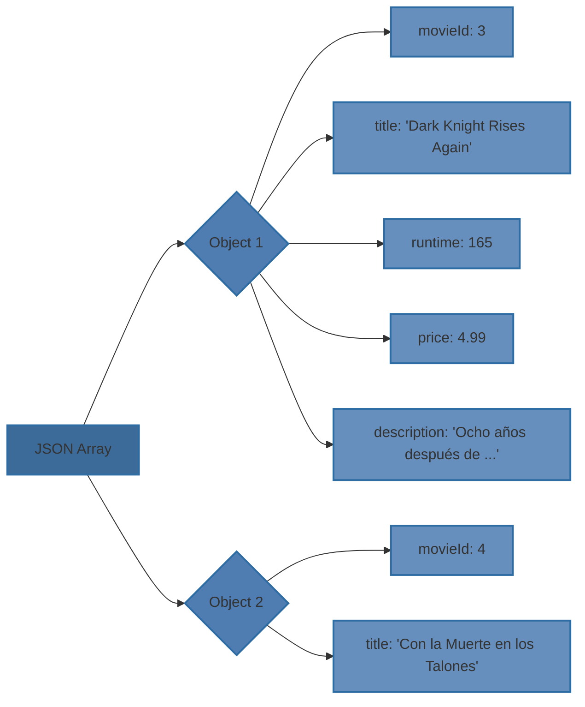

***[[Internet y Sistemas Distribuidos]]***

**INTRODUCCIÓN A LENGUAJES DE INTERCAMBIO DE DATOS**
****
La capa modelo es un servicio que puede ser utilizado por aplicaciones remotas. Se caracterizan por:
- Pueden residir en otras máquinas o acceder a la capa modelo a través de Internet.
- Pueden estar escritas en cualquier lenguaje de programación.
- Pueden usar otras bases de datos o aplicaciones.

- [i] Utilizan lenguajes XML, JSON y YAML como lenguajes de formato de datos.

***Utilidades***
- Intercambio de datos entre aplicaciones heterogéneas.
- Generación de vistas a partir de documentos de datos.
- Bases de datos.
- Configuración de aplicaciones (`pom.xml`).

**XML**
****
>Lenguaje de tags similar a HTML que impone una serie de normas sobre el uso de tags.

Las normas son:
- Siempre se abren y se cierran y dentro pueden tener tags animados.
- Todos los documentos tienen un tag raíz.
- Pueden tener atributos.

Sirve para expresar información estructurada y parseable.

***Formato de un documento XML***
Un documento XML es una secuencia de caracteres que contiene texto en dicho formato. 
Una aplicación HTML es un conjunto particular de tags que permite representar información.

- [n] Distingue entre mayúsculas y minúsculas.

1. *Comentarios*
	```xml
	<!-- comentario -->
	```
2. *Declaración*
	No es obligatoria, pero tiene que aparecer al principio del documento.
	```xml
	<?xml version="1.0" encoding="UTF-8"?>
	```
3. *Elementos y atributos*
	Todos los documentos deben tener un elemento raíz. 
	Un elemento o tag puede tener atributos (van entrecomillados con comillas dobles o simples).
	
	Otra notación es el elemento vacío, que no contiene elementos anidados ni texto pero puede tener atributos.
	```xml
	<tag-1 attr-1="val1" attr-2="val2"></tag-1>
	<!-- Por comodidad, se suele representar como: -->
	<tag-1 attr-1="val1" attr-2="val2"/>
	```
	Para aumentar la claridad se suelen seguir unas convenciones, no obligatorias:
	- Usar elementos para datos multivaluados.
		```xml
		<colores> 
			<color>Rojo</color> 
			<color>Verde</color> 
			<color>Azul</color> 
		</colores>
		```
	- Usar contenido de elementos para datos de gran cantidad de texto.
		```xml
		<articulo>
		    <titulo>El Viaje del Héroe</titulo>
		    <contenido>
		        El viaje del héroe es un arquetipo narrativo que se encuentra presente en mitos y leyendas de diversas culturas a lo largo de la historia.
		        ...
		        (Texto extenso)
		        ...
		    </contenido>
		</articulo>
		```
	- Usar atributos o contenido de elementos en cualquier otro caso.
		```xml
		<libro id="123">
		    <titulo>La Sombra del Viento</titulo>
		    <autor>Carlos Ruiz Zafón</autor>
		    <anoPublicacion>2001</anoPublicacion>
		</libro>
		```

***Espacio de nombres***
>Mecanismo utilizado para evitar conflictos de nombres cuando se emplean elementos y atributos con etiquetas personalizadas en un documento XML.

El propósito principal es que diferentes vocabularios o estándares XML coexistan en un mismo documento sin ambigüedades o conflictos de nomenclatura.

Se identifican mediante URIs que pueden ser URLs o cualquier otra cadena que proporcione un ID único.
```xml
<libro xmlns="http://www.ejemplo.com/libros">
  <titulo>XML y sus aplicaciones</titulo>
  <autor>Jane Doe</autor>
</libro>

<!--Utilizando un prefijo para los elementos y atributos-->
<libro:libro xmlns:libro="http://www.ejemplo.com/libros">
  <libro:titulo>XML y sus aplicaciones</libro:titulo>
  <libro:autor>Jane Doe</libro:autor>
</libro:libro>

<?xml version="1.0" encoding="UTF-8"?>
<movies xmlns="http://ws.udc.es/movies/xml" xmlns:review="http://reviews.example.com">
   <movie>
      <movieId>3</movieId>
      <title>Dark Knight Rises Again</title>
      <runtime>103</runtime>
      <description>Ocho años después ...</description>
      <review:title>Cualquiera puede ser un héroe</review:title>
      <review:description>Es difícil hacer una crítica de una película tan compleja ...</review:description>
      <review:rating>4</review:rating>
   </movie>
</movies>
```

***Validación de documentos XML***
Existen algunos tipos de esquemas para expresar que atributos y elementos son válidos en una aplicación XML y que restricciones tienen. Dos estándares utilizados son:
1. *DTD (Document Type Definition)*
	Declaraciones que describen los elementos, atributos y la relación entre ellos.
	```xml
	<!DOCTYPE library [
	  <!ELEMENT library (book+)>
	  <!ELEMENT book (title, author, genre, price)>
	  <!ELEMENT title (#PCDATA)>
	  <!ELEMENT author (#PCDATA)>
	  <!ELEMENT genre (#PCDATA)>
	  <!ELEMENT price (#PCDATA)>
	  <!ATTLIST book id CDATA #REQUIRED>
	]>
	```
2. *XML Schema*
	Alternativa en XML más avanzada al DTD.
	```xml
	<xs:schema xmlns:xs="http://www.w3.org/2001/XMLSchema">
	  <xs:element name="library">
	    <xs:complexType>
	      <xs:sequence>
	        <xs:element name="book" maxOccurs="unbounded">
	          <xs:complexType>
	            <xs:sequence>
	              <xs:element name="title" type="xs:string"/>
	              <xs:element name="author" type="xs:string"/>
	              <xs:element name="genre" type="xs:string"/>
	              <xs:element name="price" type="xs:decimal"/>
	            </xs:sequence>
	            <xs:attribute name="id" type="xs:integer" use="required"/>
	          </xs:complexType>
	        </xs:element>
	      </xs:sequence>
	    </xs:complexType>
	  </xs:element>
	</xs:schema>
	```

**PARSING DE XML**
****
***Tipos de parsers***
1. *DOM*
	Construyen un árbol en memoria basado en el documento XML y permiten crear y modificar el XML. El principal problema es el uso de memoria.
2. *Streaming*
	Procesan secuencialmente el código en bloques. No tiene soporte para generar XML, pero consumen mucha menos memoria.

***Parsers en Java***
1. *SAX*
	Parser de tipo streaming de Java SE eficiente y basado en eventos.
2. *DOM*
	Parser de tipo DOM de Java SE.
3. *JDOM*
	Alternativa a DOM pensada para Java.

**JSON**
****
>JSON son las siglas de JavaScript Object Notation. Permite expresar información estructurada y fácilmente parseable. Se basa en structs y arrays.

***Documento JSON***
Secuencia de caracteres que contiene texto en formato JSON.
```json
[
	{
	"movieId": 3,
	"title": "Dark Knight Rises Again",
	"runtime": 165,
	"releaseDate": { "day": 20, "month": 7, "year": 2012 },
	"directors": [ "Cristopher Nolan" ],
	"actors": [ "Christian Bale", "Morgan Freeman" ],
	"genres": [ "THR" ],
	"price": 4.99,
	"description": "Ocho años después de los acontecimientos de The Dark Knight, Gotham se encuentra en un estado de paz. En virtud de los poderes otorgados por la Ley Dent, el comisario Gordon casi ha erradicado la violencia y el crimen organizado. Sin embargo, todavía se siente culpable por el encubrimiento de los crímenes de Harvey Dent."
	},
	{
	"movieId": 4,
	"title": "Con la Muerte en los Talones",
	"runtime": 136,
	"releaseDate": { "day": 26, "month": 9, "year": 1959 },
	"directors": [ "Alfred Hitchcock" ],
	"actors": [ "Cary Grant", "Eve Marie Saint", "James Manson" ], 
	"genres": [ "THR", "COM" ], "price": 3.99,
	"description": "Roger O. Thornhill (Cary Grant) es un ejecutivo publicitario de Nueva York al que unos espías confunden con un agente del gobierno. Debe escapar, pero lo siguen de cerca. Durante la fuga conoce a una atractiva mujer, Eve Kendall (Eva Marie Saint), que lo ayuda." 
	} 
]
```

- [i] En JSON no hay comentarios, atributos ni espacio de nombres. 

***Esquemas JSON***
>Contiene un objeto con campos que imponen un conjunto de restricciones.
- *Campos descriptivos*
	- `$schema`: indica que el documento es un esquema y su versión.
	- `$id`: asigna un valor único al esquema.
	- `$comment`: permite añadir comentarios.

**PARSING DE JSON**
****
***Tipos de parsers***
1. *Modelo de árbol o de objetos*
	Son similares a los DOM de XML. Construyen un árbol en memoria equivalente al documento JSON.
2. *Streaming*
	Similares a los tipo streaming de XML. Procesan secuencialmente el código en bloques.

***Parsers y validadores en Java***
El API estándar para parsear JSON es JSON-P, aunque existen mejores alternativas, como Jackson.

Al contrario que con los parsers, no existe un estándar para los validadores.

***Jackson***
Contiene:
- Clases que modelan distintos tipos de nodo del árbol Jackson.
- Clases que permiten construir el árbol Jackson a partir de un JSON.
- Clases que permiten construir un JSON a partir de un Jackson.

```json
[
  {
    "movieId": 3,
    "title": "Dark Knight Rises Again",
    "runtime": 165,
    "price": 4.99,
    "description": "Ocho años después de ... "
  },
  {
    "movieId": 4,
    "title": "Con la Muerte en los Talones",
    "runtime": 136,
    "price": 3.99,
    "description": "Roger O. Thornhill (Cary Grant) es un ... "
  }
]
```



Para transformar un JSON en un Jackson se usan `ObjectMapper`, `ObjectWritter` y `JsonNodeFactory`. En Movies utilizamos las siguientes clases:
- `toObjectNode`: recibe un `RestMovieDto` y genera un árbol Jackson.
- `toArrayNode`: recibe una lista de `RestMovieDto` y genera un árbol Jackson.
- `toRestMovieDto`: recibe un JSON y crea un `RestMovieDto`.