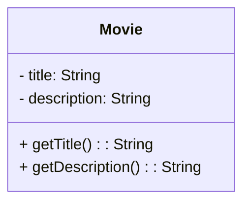

***[[Ingeniería Requisitos]]***

**INTRODUCCIÓN A LOS DIAGRAMAS DE CLASES**
****
Un diagrama de clases es un diagrama estructural que muestra los elementos principales de un sistema y sus relaciones. Está orientado a objetos.

```java
public class Movie{
	private String title;
	private String description;

	public Movie(String title, String description){
		this.title = title;
		this.description = description;
	}

	private String getTitle(){
		return title;
	}

	private String getDescription(){
		return description
	}
}
```



- **Ventajas**
	- [p] Facilita el análisis.
	- [p] Facilitar que los clientes y el equipo técnico lo entiendan.
	- [p] Son auto-explicativos.
	- [p] La notación es independiente del código.
	- [p] Se usan en diseño de patrones. 
	
- **Pautas**
	1. Listar las clases involucradas.
	2. Representarlas en diagrama de clases.
	3. Añadir asociaciones.
	4. Añadir atributos.


**EJEMPLO DE DISEÑO DEL TORNO DE ENTRADA AL METRO**
****
1. **Descripción**
	El objetivo es cobrar 1 euro a cualquier usuario que entre al metro. No se puede entrar sin pagar. Cualquiera que introduzca 1 euro puede pasar.

	Para solucionar los posibles problemas hay un guardia en la puerta cobrando la entrada. Si alguien intenta colarse lo detiene. Se tiene que crear el software para el sistema de entrada de torno usado.

2. **Sistema y entorno**
	El sistema y el entorno actúan a través de los eventos compartidos.

	El entorno controla que se meten monedas en la ranura. El sistema detecta la moneda y desbloquea la barrera. El entorno detecta que la barrera está desbloqueada y el usuario puede entrar. El sistema detecta que la barrera está girando y pasado un tiempo la bloquea.

3. **Requisitos**
	- Cuando un usuario mete una moneda, se desbloquea el torno.
	- El usuario puede pasar cuando el torno está desbloqueado.
	- Si el torno está bloqueado mucho tiempo, se bloquea automáticamente.
	- Cuando el torno haya girado un tercio, se bloquea de nuevo.

4. **Entidades**
	En el entorno tenemos al viajero, las monedas y el torno. En la interfaz tenemos la ranura de monedas y la barrera. Por último, en el sistema tenemos el propio software.

![[Pasted image 20240526200710.png]]

**RELACIONES**
****
1. **Asociación**
	Implica una dependencia y se identifica como una línea continua.
2. **Agregación**
	Representa una clase formada por otras clases. Se identifica fácilmente pensando en si una clase "contiene" a otras clases. Se representa como un rombo vacío.
3. **Composición**
	Es una agregación fuerte. Indica que una parte no puede existir si las partes que la componen no existen. Se representa con un rombo lleno.
4. **Dependencia**
	A veces una clase depende de otra para realizar ciertas funciones. Se representa con una flecha discontinua.
5. **Herencia**
	Una clase puede heredar propiedades o atributos de otra. Se representa con un triángulo.

![[Pasted image 20240526201118.png]]

**APLICACIÓN DE DIAGRAMAS DE CLASES**
****
Los ingenieros de requisitos deben detectar e identificar lo que no entienden del dominio para hacer las preguntas necesarias para aclararlo.

En las primeras fases de la extracción de requisitos, las decisiones parten de la ignorancia.

Podemos partir de:
- Un substantivo es una clase.
- Un verbo es un método.
- Un adjetivo es una propiedad.
- Un adverbio es un RNF.